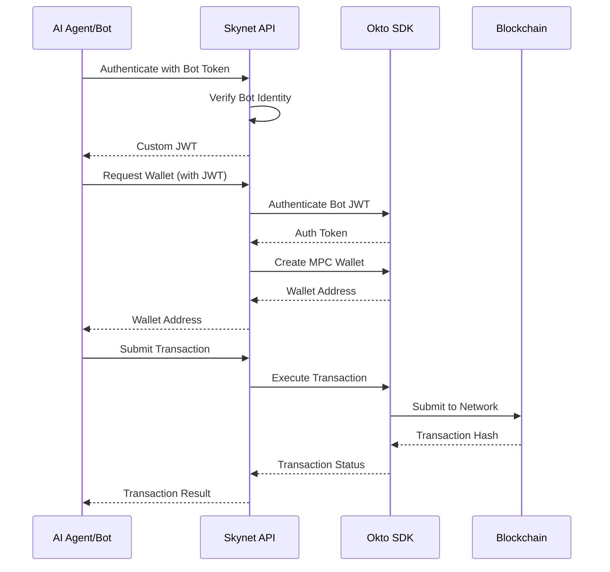

# Skynet Orchestration Layer

An orchestration layer enabling AI agents and bots to interact with blockchain wallets using Okto's MPC and Account Abstraction infrastructure.

## Architecture



## Key Features

- **Bot Identity Layer**: Secure authentication via Telegram Bot API
- **Custom JWT Flow**: Seamless integration with Okto SDK  
- **MPC Wallet Creation**: Automated wallet provisioning
- **Transaction Support**: Both EVM and Move-based chains
- **Built-in Retries**: Exponential backoff for reliability

## API Endpoints

### Authentication

```http
POST /api/v1/jwt
GET /api/v1/jwt/verify
```

### Wallet Operations

```http
POST /api/v1/wallet
POST /api/v1/wallet/execute-tx
```

## Quick Start

```typescript
// 1. Authenticate Bot
const jwt = await fetch('/api/v1/jwt', {
  headers: { 'X-TG-BOT-TOKEN': BOT_TOKEN }
});

// 2. Create Wallet
const wallet = await fetch('/api/v1/wallet', {
  headers: { 
    'Authorization': `Bearer ${jwt.token}`,
    'X-TG-BOT-TOKEN': BOT_TOKEN
  }
});

// 3. Execute Transaction
const tx = await fetch('/api/v1/wallet/execute-tx', {
  method: 'POST',
  headers: { 'Authorization': `Bearer ${jwt.token}` },
  body: JSON.stringify({
    network_name: "POLYGON_TESTNET_AMOY",
    transaction: {
      to: "0x...",
      data: "0x...",
      value: "0"
    }
  })
});
```

## Supported Networks

- Polygon Mumbai (POLYGON_TESTNET_AMOY)
- Aptos Testnet (APTOS_TESTNET)

## Security

- Bot verification via Telegram API
- JWT with 7-day expiry
- Environment-based secrets
- Request retry mechanism

## Local Development

```bash
# Install
yarn install

# Development
yarn dev 

# Production
yarn build
yarn start
```

## Environment Variables

```env
PORT=3000
JWT_SECRET=your_jwt_secret
OKTO_API_SECRET=your_okto_api_key
OKTO_API_BASE_URL=https://api.okto.tech
```

## License

MIT